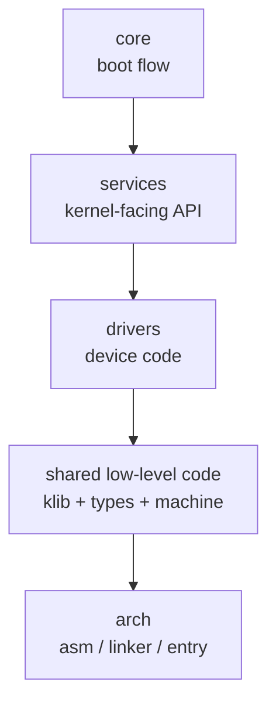
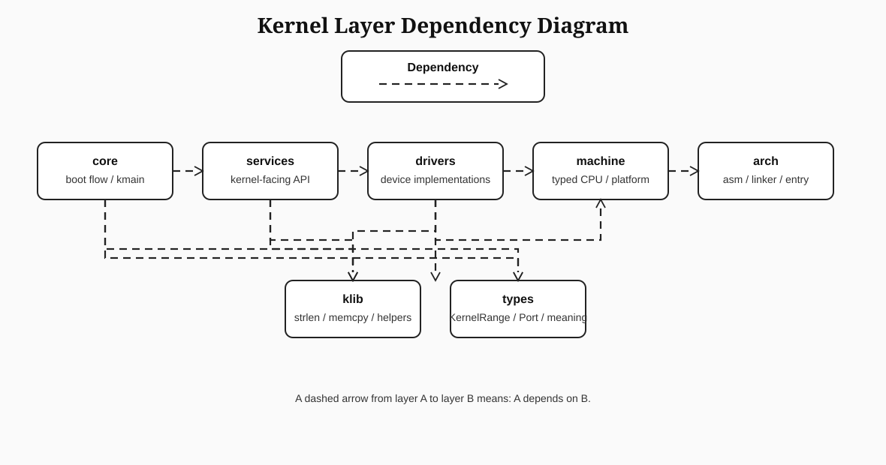

# KFS-1 Kernel Architecture Proposal


Purpose:
- describe what architecture the repo is using now
- explain why the current boundary model is inconsistent
- compare recognized kernel architecture families and internal module organizations
- choose one target architecture for the whole KFS progression
- define enforceable dependency rules so later features do not invent a new structure each time

---

## 1. Subject basis

Subject-mandated obligations relevant to architecture:
- the project is an i386 kernel
- GRUB initializes and transfers control to the kernel
- the kernel contains boot code, linker control, chosen-language kernel code, helper functions, and a screen interface
- the Makefile must compile all source files with the correct flags and produce a bootable image
- the project later grows into cursor, scrolling, colors, printing helpers, keyboard echo, and multiple screens

The architecture is not specified by the subject:
- how internal kernel modules are organized
- where ABI boundaries exist
- whether helpers, drivers, and orchestration live in one layer or several
- whether Rust-to-Rust subsystem calls should use source/module boundaries or binary/ABI-style boundaries


Primary sources:
- `docs/subject.pdf`
- `docs/kfs1_epics_features.md`
- `docs/kfs1_repo_status.md`
- `Makefile`

External sources:
- OSDev Wiki pages on kernel families and monolithic kernels
- *Writing an OS in Rust* (Philipp Oppermann), especially VGA/module-encapsulation examples
- *The Rust Programming Language*, Chapter 7, for modules, paths, and privacy
- OSTEP and xv6 material for monolithic-vs-microkernel vocabulary

---

## 2. Current repo status

This section is descriptive, not normative.
It records what the repository does today before proposing a cleaner target architecture.


### 2.1 Present status

- ASM boot/linker artifacts live under `src/arch/i386/`
- Rust kernel sources live under `src/kernel/`
- the current kernel entrypoint is `src/kernel/kmain.rs`
- helper families exist as top-level Rust files:
  - `src/kernel/string.rs`
  - `src/kernel/memory.rs`
  - `src/kernel/vga.rs`
- shared semantic types exist in:
  - `src/kernel/types.rs`
  - `src/kernel/types/port.rs`
  - `src/kernel/types/range.rs`
- private implementation files already exist for some families:
  - `src/kernel/string/string_impl.rs`
  - `src/kernel/memory/memory_impl.rs`
  - `src/kernel/kmain/logic_impl.rs`

- `Makefile` compiles every top-level `src/kernel/*.rs` file independently into an object file:
  - `rust_source_files := $(wildcard src/rust/*.rs) $(filter-out src/kernel/types.rs,$(wildcard src/kernel/*.rs))`
- those objects are then linked together with `ld`

- some Rust-to-Rust boundaries are expressed as C ABI-style exported symbols:
  - `kfs_strlen`
  - `kfs_strcmp`
  - `kfs_memcpy`
  - `kfs_memset`
  - `vga_init`
  - `vga_putc`
  - `vga_puts`
- some exported symbols exist for proof/test purposes rather than normal Rust-to-Rust calls:
  - `kfs_vga_writer_marker`

- other boundaries are pure source inclusion:
  - `types.rs`
  - `*_impl.rs`

- `kmain` currently owns runtime orchestration and also directly depends on low-level helper and device-facing surfaces

### 2.2 What architecture that implies today

The repo is not using one architecture. It is using several at once.

| Concern | Current repo pattern | Implication |
|---|---|---|
| ASM to Rust entry | true ABI boundary | expected and correct |
| Linker symbols to Rust | true ABI boundary | expected and correct |
| Shared helper internals | source inclusion | normal private implementation pattern |
| Top-level kernel features | separate linked object files | pseudo-component model |
| Rust-to-Rust feature calls | often `extern "C"` | fake internal ABI |
| `kmain` ownership | orchestration plus subsystem knowledge | weak separation |

### 2.3 Architectural smells in the current repo

- there is no single answer to "what is a kernel module in this repo?"
- some top-level Rust files behave like independent linked components
- some internal files behave like normal source modules
- some internal Rust boundaries use ABI symbols even though they are not true external boundaries
- `kmain` still knows details that should eventually belong to subsystem-specific layers

---

**The repo currently mixes at least three boundary styles that do not describe one shared architecture.**

This is the key point: these styles encode different answers to the same question, "how do kernel parts relate to each other?"
Because all three are active at once, the repo does not currently have a single internal architecture.

---

### Source inclusion

Example:

```rust
// src/kernel/types.rs
#[path = "types/port.rs"]
mod port;
#[path = "types/range.rs"]
mod range;

pub use self::port::Port;
pub use self::range::KernelRange;
```

```rust
// src/kernel/string.rs
#[path = "string/string_impl.rs"]
mod string_impl;
use string_impl::{string_cmp_impl, string_len_impl};
```

Reason to change:
- this pattern is valid for private internals on its own
- it assumes one coherent Rust module tree with source-level ownership
- it conflicts with the repo's other active model where top-level files are treated as separately linked components
- therefore, source inclusion itself is not a problem; using it beside incompatible boundary models without one rule is the bug

---

### Link-time component separation

Example:

```makefile
# Makefile
rust_source_files := $(wildcard src/rust/*.rs) \
  $(filter-out src/kernel/types.rs, $(wildcard src/kernel/*.rs))

rust_object_files := $(patsubst src/%.rs, \
  build/arch/$(arch)/rust/%.o, $(rust_source_files))

build/arch/$(arch)/rust/%.o: src/%.rs
	rustc --crate-type lib --emit=obj ... -o $@ $<
```

```makefile
$(kernel): $(assembly_object_files) $(rust_object_files) $(linker_script)
	ld -m elf_i386 -n -T $(linker_script) -o $(kernel) \
	    $(assembly_object_files) $(rust_object_files)
```

Why to keep/change:
- this pattern turns file placement into an architectural decision (`src/kernel/*.rs` becomes "component-like")
- there is no explicit subsystem contract attached to that decision (no module tree contract, no declared facade rule)
- `types.rs` being excluded proves this is not a consistent architecture rule, but a build-time special case
- result: adding a new file changes structure mechanically via Makefile globbing, not by architecture intent

---

### ABI-style symbol boundaries

Example:

```rust
// src/kernel/string.rs
#[no_mangle]
pub unsafe extern "C" fn kfs_strlen(ptr: *const u8) -> usize { ... }
```

```rust
// src/kernel/vga.rs
#[no_mangle]
pub extern "C" fn vga_init() { ... }
#[no_mangle]
pub extern "C" fn vga_puts(text: *const u8) { ... }
```

```rust
// src/kernel/kmain.rs
unsafe extern "C" {
  static kernel_start: u8;      // ABI edge: linker symbol
  static kfs_test_mode: u8;     // ABI edge: asm symbol
  fn vga_init();                // Rust-to-Rust call via C ABI
  fn kfs_strlen(ptr: *const u8) -> usize; // Rust-to-Rust call via C ABI
}
```

```asm
; src/arch/i386/boot.asm
extern kmain
call kmain
```

Reason to change/keep:
- true ABI edges (ASM/linker) are required and correct
- internal Rust-to-Rust calls using the same ABI mechanism are an accidental boundary choice in this repo
- mixing both in one import surface hides which boundaries are truly external versus internal
- result: internal subsystem boundaries become C-ABI-shaped instead of architecture-shaped

---

### Why this is architecturally incorrect

This file's architecture target is a layered monolithic kernel with clear subsystem ownership.
The current mixed boundary model violates that target in concrete ways:

| Required architectural question | Current repo answers | Result |
|---|---|---|
| "What is a kernel module?" | sometimes an included source file, sometimes a separately linked file, sometimes an ABI symbol group | no single module definition |
| "How should one Rust subsystem call another?" | sometimes direct module use, sometimes linker symbol, sometimes `extern "C"` | no consistent internal call contract |
| "Which ABI edges are truly external?" | mixed in one `extern "C"` import surface | accidental ABI hardening of internals |
| "Where does a new feature file belong?" | determined by Makefile glob + symbol export habit | mechanical placement, not architectural placement |

In short: the repo is not choosing between architecture options; it is running multiple incompatible boundary contracts at once.

---

## 3. Architecture definition

- what counts as a kernel subsystem
- what counts as a private implementation detail
- where ABI boundaries are real and where they are accidental
- where shared semantic types belong
- whether `kmain` is an orchestrator or a place where feature logic accumulates
- what architecture can scale through the later subject work without each feature choosing a different pattern

The rest of this document tries to answer that question with explicit alternatives and a final decision.

---

## 4. Architecture comparison matrix

### 4.1 Kernel-family comparison

This section compares the main kernel-family options using criteria relevant to this repo.

| Architecture family | Description | Internal boundary style | Strengths | Weaknesses | Long-term growth | Fit |
|---|---|---|---|---|---|---|
| Flat monolith | one kernel with little separation | almost none | fastest bring-up | becomes tangled quickly | poor | poor |
| Monolithic kernel | one kernel with internal subsystems | source/module boundaries | simple, efficient, common hobby-kernel path | needs discipline | strong | strong |
| Modular monolith | monolithic kernel with loadable/runtime modules | internal APIs plus possible runtime symbol interfaces | future extensibility | more loader/API complexity | strong | too heavy as a first commitment |
| Hybrid kernel | mixed model with selective decomposition | mixed | flexible in theory | often vague in practice | medium | weak fit here |
| Microkernel | minimal kernel, services moved out | process/IPC boundaries | strong isolation | high complexity and early design burden | high in theory | poor for this project stage |

Architecture-family conclusion:
- a monolithic kernel is the right base family
- a microkernel or hybrid design adds complexity too early
- a modular kernel is a later optional refinement, not the starting commitment

### 4.2 Internal organization comparison

This is the more important comparison for this repo.

| Internal organization | What it means | Current repo similarity | Growth behavior | Refactor pressure later | Architectural clarity |
|---|---|---|---|---|---|
| Ad hoc per-feature layout | each feature chooses its own file/boundary model | high | bad | extreme | poor |
| File-per-feature linked components | each top-level file is a pseudo-component | high | medium | high | medium-low |
| Layered monolith | one kernel with clear source layers | low | strong | low | strong |
| Layered monolith with subsystem facades | one kernel, plus stable service/driver separation | low | strongest | lowest | strongest |

### 4.3 ABI-boundary comparison

This comparison is about binary ABI usage, not about whether the kernel should have explicit contracts.
The real decision for this repo is not "ABI or no structure". The real decision is whether internal ABI use is absent, universal, ad hoc, or deliberately limited to specific kernel surface files.

| ABI strategy | Meaning | Benefit | Cost | Recommended? |
|---|---|---|---|---|
| No internal kernel ABI | only ASM/linker/external edges use ABI; all kernel code talks through Rust module boundaries | simplest binary model | rejects stable low-level kernel symbol surfaces for helper/device entry families | no |
| ABI between all top-level Rust parts | every major Rust part is exposed as a C ABI surface | uniform rule | over-hardens typed/stateful subsystems and forces ABI-shaped signatures everywhere | no |
| Mixed ad hoc ABI | some Rust internals use ABI, some do not, with no file-role rule | local convenience only | maximum confusion and no architectural predictability | no |
| Stratified kernel ABI | true external edges use ABI; selected low-level kernel surface files also expose ABI; private implementation stays Rust-internal | stable low-level contracts without forcing ABI on every file | requires explicit file-role rules and enforcement | yes |

Visual examples for each ABI strategy:

`No internal kernel ABI`

```rust
// kmain.rs
use crate::kernel::string::string_len;
use crate::kernel::vga::puts;

puts(b"42\0".as_ptr());
let len = unsafe { string_len(b"ok\0".as_ptr()) };
```

Effect:
- all internal calls are plain Rust module calls
- there is no stable exported kernel symbol surface for helper/device families

`ABI between all top-level Rust parts`

```rust
// every top-level file exports ABI
#[no_mangle]
pub unsafe extern "C" fn kfs_strlen(ptr: *const u8) -> usize { ... }

#[no_mangle]
pub extern "C" fn vga_puts(text: *const u8) { ... }

#[no_mangle]
pub extern "C" fn port_outb(port: u16, value: u8) { ... }
```

Effect:
- uniform binary boundary rule
- even typed/stateful internals get flattened into ABI-shaped signatures

`Mixed ad hoc ABI`

```rust
// kmain.rs
unsafe extern "C" {
    fn kfs_strlen(ptr: *const u8) -> usize;
}

use crate::kernel_types::Port;
use crate::kmain_logic::layout_order_is_sane;
```

Effect:
- one file calls some things through ABI, some through normal Rust modules
- the boundary model depends on file history, not architecture

`Stratified kernel ABI`

```rust
// stable ABI surface
#[no_mangle]
pub unsafe extern "C" fn kfs_strlen(ptr: *const u8) -> usize {
    unsafe { string_len(ptr) }
}

// private leaf implementation
pub unsafe fn string_len(ptr: *const u8) -> usize {
    unsafe { string_impl::string_len_impl(ptr) }
}
```

Effect:
- low-level kernel entry surfaces remain stable and callable through ABI
- private algorithms, typed helpers, and policy logic stay Rust-internal

Immediate consequence under the proposed rule:
- This stays ABI:
  - `src/arch/i386/boot.asm -> kmain`
  - linker symbols such as `kernel_start`, `kernel_end`, `bss_start`, `bss_end` used from `src/kernel/kmain.rs`
  - `kmain.rs` importing `vga_init`, `vga_puts`, `kfs_strlen`, `kfs_strcmp`, `kfs_memcpy`, and `kfs_memset`
- This also stays ABI on purpose:
  - `src/kernel/string.rs` exporting `kfs_strlen` and `kfs_strcmp`
  - `src/kernel/memory.rs` exporting `kfs_memcpy` and `kfs_memset`
  - `src/kernel/vga.rs` exporting `vga_init`, `vga_putc`, `vga_puts`, and the proof marker `kfs_vga_writer_marker`
- This stays internal-only Rust:
  - `src/kernel/string/string_impl.rs` remains the private leaf for `kfs_strlen` and `kfs_strcmp`
  - `src/kernel/memory/memory_impl.rs` remains the private leaf for `kfs_memcpy` and `kfs_memset`
  - `src/kernel/kmain/logic_impl.rs` remains internal logic called through normal Rust use, not exported ABI
  - `src/kernel/types.rs` and `src/kernel/types/*` remain shared semantic types, not exported ABI surfaces
- Therefore this would be a violation under the chosen rule:
  - adding `#[no_mangle] pub extern "C"` exports inside `string_impl.rs`, `memory_impl.rs`, or `logic_impl.rs`
  - turning `types.rs` or `types/*` into symbol-export files just because another file wants to call them
  - creating a new top-level kernel file and exporting ABI from it without first designating it as a kernel ABI-surface file

### 4.4 Type and helper comparison


The ABI strategy decides which files are stable binary surfaces.
The type/helper model then decides what is allowed to cross those surfaces and what must stay behind them.

**If ABI is used everywhere:**
- more data tends to collapse into primitives, raw pointers, and flat signatures
- richer typed/stateful internals become harder to preserve cleanly

**If there is no internal ABI at all:**
- helpers and drivers can stay purely Rust-internal
- but you lose the low-level symbol surfaces that the repo currently uses for helper/device entry files
- that is a repo design tradeoff, not a subject-mandated requirement

**With the chosen stratified ABI model:**
- low-level ABI-surface files *should expose primitive or low-level signatures*
- *semantic types belong behind those surfaces* unless the type itself is a stable cross-subsystem concept
- helper families should have one stable public entry file and private leaf implementation files
- `types` should support internal correctness and meaning, not become a dumping ground for exported ABI wrappers

| Model | Shared types | Helper library | Driver structure | Result |
|---|---|---|---|---|
| Everything primitive | none | scattered | drivers leak details upward | weak semantics |
| Wrap everything | too many types | bloated | high ceremony | artificial architecture |
| Semantic shared types only | only stable domain concepts | dedicated `klib`/helper layer | drivers remain focused | best balance |

Visual examples:

`Everything primitive`

```rust
pub extern "C" fn console_write_at(row: usize, col: usize, color: u8, ptr: *const u8) { ... }
```

Problem:
- every caller manipulates raw positions/colors directly
- driver details leak upward immediately

`Wrap everything`

```rust
pub struct ScreenRow(usize);
pub struct ScreenCol(usize);
pub struct ScreenColor(u8);
pub struct ByteCount(usize);
pub struct PortOffset(u16);
```

Problem:
- many wrappers carry little domain value
- the architecture becomes ceremony-heavy instead of clearer

`Semantic shared types only`

```rust
pub struct KernelRange {
    pub start: usize,
    pub end: usize,
}

pub struct Port(u16);
```

Result:
- stable concepts get type meaning
- helper/device entry surfaces can still stay low-level where needed
- typed semantics stay behind or beside ABI surfaces instead of forcing every call to become raw

With both the ABI exposure and type model decided, we can state the file-role rule more clearly:
- `string.rs`, `memory.rs`, and `vga.rs` are ABI-surface files
- `string_impl.rs` and `memory_impl.rs` are private leaf implementations
- `types.rs` and `types/*` keep semantic concepts such as `Port` and `KernelRange`
- therefore `Port` and `KernelRange` should not become ABI wrappers just because helper/device files use ABI
- therefore helper logic should not move into `types` just because helper files and type files are both "low level"

**Type-system recommendation**:
- shared types should exist only for stable domain concepts
- helper routines should live in a dedicated kernel-library layer
- hardware-facing logic should not leak directly into orchestration

---

## 5. Proposed architecture

### 5.1 Chosen architecture

**Proposition:**
- use a statically linked monolithic kernel
- organize it as layered Rust subsystems with a stratified kernel ABI model
- keep ABI only where the boundary is either:
  - a mandatory external/toolchain edge
  - a deliberately designated low-level kernel surface file
- keep nested leaf files, semantic type files, and richer policy/orchestration logic Rust-internal by default

Why:
- this fixes the current inconsistency where some files behave like ABI components, some behave like Rust modules, and the rule is not stated anywhere
- it preserves the low-level ABI surfaces that are already useful for helper/device entry families
- it avoids flattening every typed or stateful internal concern into primitive ABI signatures
- it gives one file-role rule that can be enforced mechanically instead of relying on per-file habit

Justifications:
- the subject requires a bootable monolithic kernel, helper families such as `strlen` / `strcmp`, and a screen interface
- OSDev monolithic-kernel guidance supports one kernel binary with internal subsystem ownership
- the Rust module/privacy model supports keeping implementation details behind explicit module boundaries
- Phil Opp's VGA writer approach supports keeping stateful device logic encapsulated instead of spreading raw memory writes through `kmain`

Current rule for the status quo repo:
- `src/arch/i386/*` and linker symbols remain true external/toolchain ABI edges
- `src/kernel/kmain.rs`, `src/kernel/string.rs`, `src/kernel/memory.rs`, and `src/kernel/vga.rs` are the current designated ABI-surface files
- `src/kernel/string/string_impl.rs`, `src/kernel/memory/memory_impl.rs`, `src/kernel/kmain/logic_impl.rs`, `src/kernel/types.rs`, and `src/kernel/types/*` are internal files and must not become exported ABI surfaces by default

### 5.2 Layer model

The proposed architecture has six kernel layers plus one cross-cutting ABI rule.




- `core` decides **what the kernel does first**
- `services` define **the API the rest of the kernel wants**
- `drivers` know **how a device actually works**
- `klib` provides **device-independent helper routines**
- `types` provide **shared meaning**, not policy
- `machine` provides **typed low-level CPU/platform primitives**
- `arch` is the **real hardware/toolchain edge**

Important current-repo note:
- the repo does **not** yet have one directory per layer
- some future layers are still collapsed together in one file
- the architecture model still matters because it tells us where new code belongs and what may depend on what

| Layer | Layman explanation | Present in | Typical future contents | May depend on | Must not depend on |
|---|---|---|---|---|---|
| `arch` | get the CPU into the kernel and define the binary layout | `src/arch/i386/boot.asm`, `src/arch/i386/linker.ld` | interrupt stubs, GDT/IDT entry glue, linker symbols | none | upper layers |
| `machine` | wrap raw machine details in typed primitives | `src/kernel/types/port.rs` is machine-adjacent today | `inb/outb`, register wrappers, CPU flags helpers | `arch` | services/core policy |
| `types` | define shared semantic data | `src/kernel/types/range.rs` | screen position, color type, address ranges | none or `machine` | policy logic |
| `klib` | reusable freestanding helpers | `src/kernel/string.rs`, `src/kernel/memory.rs` | `strlen`, `strcmp`, `memcpy`, `memset` | `types` | device logic and boot flow |
| `drivers` | talk to hardware | `src/kernel/vga.rs` today | VGA, serial, keyboard, PIC helpers | `arch`, `machine`, `types`, `klib` | boot sequencing policy |
| `services` | expose kernel-facing interfaces above drivers | not split out yet | console API, logger, terminal API | `drivers`, `types`, `klib` | raw bootstrap concerns |
| `core` | orchestrate initialization and checks | `src/kernel/kmain.rs` | boot order, panic path, subsystem bring-up | `services`, `klib`, `types` | raw device details and machine code |

How we map to this model:
- `src/arch/i386/boot.asm` and `src/arch/i386/linker.ld` map to `arch`
- `src/kernel/types/port.rs` is a `machine`-adjacent typed primitive
- `src/kernel/types.rs` and `src/kernel/types/range.rs` map to `types`
- `src/kernel/string.rs` and `src/kernel/memory.rs` map to `klib` ABI-surface files
- `src/kernel/string/string_impl.rs` and `src/kernel/memory/memory_impl.rs` are private `klib` leaf files
- `src/kernel/vga.rs` currently mixes `drivers` and the thinnest possible service surface
- `src/kernel/kmain.rs` maps to `core`
- `src/kernel/kmain/logic_impl.rs` is internal `core` logic, not a public boundary

ABI rule across the layers:
- `arch` is allowed and expected to expose ABI because it crosses ASM/linker boundaries
- `klib` may expose ABI for stable primitive helper families such as `kfs_strlen` and `kfs_memcpy`
- `drivers` may expose ABI only for explicitly designated low-level entry surfaces such as the current `vga_*` family
- `types` should almost never be an ABI-export layer
- `core` may expose ABI only when it is the handoff entry surface, such as `kmain`

### 5.2.1 Layer explanation

#### `arch`

Purpose:
- start execution
- set the stack
- hand control to Rust
- define linker-visible layout symbols

Example:

```asm
start:
    cli
    cld
    mov esp, stack_top
    call kmain
```


- it is not business logic
- it is not a reusable helper
- it is the CPU-entry edge of the kernel

#### `machine`

Purpose:
- take raw machine values and give them a typed meaning
- stop higher layers from passing bare integers everywhere

Example:

```rust
#[repr(transparent)]
pub struct Port(u16);

impl Port {
    pub const fn new(value: u16) -> Self { Self(value) }
    pub const fn offset(self, delta: u16) -> Self {
        Self(self.0.wrapping_add(delta))
    }
}
```

- COM1 is a hardware port concern
- a `Port` is closer to "CPU/platform primitive" than to general kernel policy

#### `types`

Purpose:
- define shared semantic objects used by several parts of the kernel
- give names to concepts such as ranges, positions, colors, addresses

Example:

```rust
#[repr(C)]
pub struct KernelRange {
    start: usize,
    end: usize,
}
```

- `KernelRange` gives meaning to two addresses
- it is reusable across layout checks and later memory code
- it does not itself decide boot policy

#### `klib`

Purpose:
- provide freestanding helper functions that do not care about VGA, serial, or boot order

Example:

```rust
#[no_mangle]
pub unsafe extern "C" fn kfs_strlen(ptr: *const u8) -> usize {
    unsafe { string_len(ptr) }
}
```

and the private implementation behind it:

```rust
pub unsafe fn string_len_impl(ptr: *const u8) -> usize {
    let mut len: usize = 0;
    loop {
        let byte = unsafe { ptr.add(len).read() };
        if byte == 0 {
            return len;
        }
        len += 1;
    }
}
```

- it is reusable
- it is device-agnostic
- `kmain` and future subsystems can both use it

#### `drivers`

Purpose:
- know the hardware layout and device behavior
- write to hardware-specific addresses or ports

Example:

```rust
const VGA_TEXT_BUFFER: *mut u16 = 0xb8000 as *mut u16;

#[no_mangle]
pub extern "C" fn vga_putc(byte: u8) {
    unsafe {
        vga_write_cell(VGA_CURSOR_INDEX, byte);
        VGA_CURSOR_INDEX += 1;
    }
}
```

- `0xb8000` is a VGA text-mode hardware detail
- writing a screen cell is device logic, not general boot logic

#### `services`

Purpose:
- provide a cleaner API above one or more drivers
- hide raw device details from the rest of the kernel

This layer is mostly future-state in the current repo.
It does not need to exist as a separate file yet, but the role should be reserved now so later features have a clear home.

Example:

```rust
pub fn console_write(text: *const u8) {
    vga_puts(text);
}
```

Why this matters:
- later the console service could choose VGA, serial, or both
- `core` should depend on "write a message", not on "poke VGA memory directly"

#### `core`

Purpose:
- decide the kernel bring-up sequence
- run checks
- decide success/failure flow

Example:

```rust
#[no_mangle]
pub extern "C" fn kmain() -> ! {
    match run_early_init() {
        Ok(()) => {
            write_42_to_vga();
            halt_forever()
        }
        Err(EarlyInitFailure::Layout) => runtime_fail("LAYOUT_FAIL"),
        // ...
    }
}
```
- `kmain` is deciding order and control flow
- it is consuming helpers and device entry points
- it is not the place where `strlen` or VGA memory layout should be implemented

### 5.3 Dependency rule summary

Visual dependency diagram:



Therefore:
- `core` may call `services`, and in the current repo it may still call designated low-level ABI-surface files directly where the higher-level service layer does not exist yet
- `services` may call `drivers`, but should not reimplement hardware access
- `drivers` may use `machine`, `types`, and `klib`
- `klib` must remain device-agnostic and should not accumulate boot orchestration or hardware policy
- `types` must not become a dumping ground for behavior-heavy policy code or exported ABI wrappers


Current incorrect patterns that this rule rejects:
- moving helper logic into `types` because both are "low level"
- exporting leaf files such as `string_impl.rs` or `memory_impl.rs` just because a caller wants direct access
- treating every new top-level kernel file as a separate ABI component
- letting `kmain` own more device-specific behavior once a driver or service file exists

### 5.4 Ownership model

| Concern | Owner |
|---|---|
| boot entry, stack setup, multiboot handoff | `arch` |
| raw x86 port semantics | `machine` |
| shared semantic wrappers such as `KernelRange` | `types` |
| `memcpy`, `memset`, `strlen`, `strcmp` | `klib` |
| VGA memory and text-mode device details | `drivers` |
| screen/console API used by the rest of the kernel | `services` |
| boot sequencing and feature bring-up | `core` |

The easiest way to read the ownership of each rule is:

```text
If the code answers "how does this hardware work?" -> drivers or machine
If the code answers "what does this value mean?"   -> types
If the code answers "how do I reuse this helper?"  -> klib
If the code answers "what should boot do next?"    -> core
If the code answers "what API should the kernel call?" -> services
```

### 5.5 Enforcement model

The architecture should be enforced at four levels.
One mechanism is not enough.

| Level | Primary audience | What it catches | Main mechanism |
|---|---|---|---|
| 1. writing-time guard | agents and coding assistants | bad file placement, bad exports, bad dependencies before they spread | prompt or skill contract plus self-check before writing |
| 2. review-time guard | humans | architectural drift that still "looks reasonable" locally | PR checklist and architecture review ownership |
| 3. static build/repo guard | local scripts and CI | tree shape, symbol exports, forbidden imports, bad build shape | shell checks over source tree, build logs, `nm`, and `readelf` |
| 4. proof guard | unit, boot, rejection, and stability tests | whether the allowed paths are real and the forbidden paths are rejected | targeted test cases mapped to each invariant |

This matters because not every rule is a unit-test rule.
Some rules are source-tree rules.
Some are symbol-table rules.
Some are runtime path rules.
If those are all forced into "unit tests", the enforcement becomes weak and confusing.

#### 5.5.1 Agent enforcement

Agents are enforced at the task-wrapper level, not by hope.
If the wrapper does not inject architecture rules into the agent task, the agent is not enforced.

Best implementation:
- create one checked-in agent guard artifact
  - either a repo-local skill such as `skills/kfs-kernel-architecture-guard/SKILL.md`
  - or a checked-in prompt file such as `docs/agent_prompts/kernel_architecture_guard.md`
- require every architecture-affecting agent task and sub-agent task to prepend that guard artifact before the user request
- require the agent to emit a preflight block before editing
- if the preflight block is missing or invalid, discard the patch and rerun the task

Recommended skill name:
- `kfs-kernel-architecture-guard`

Required preflight output:
- touched file
- owning layer
- file role
- allowed dependencies
- ABI export: `yes` or `no`
- architecture exception needed: `yes` or `no`

Hard-fail conditions for the wrapper:
- the agent creates a new top-level peer file such as `src/kernel/foo.rs`
- the agent creates a new first-level layer directory under `src/kernel/`
- the agent adds `#[no_mangle]` or `extern "C"` outside the allowlisted files from `§10.2`
- the agent imports another subsystem's private leaf
- the agent places hardware logic in `core`, `services`, or `types`
- the agent places boot policy in `drivers`, `klib`, or `types`
- the agent needs an exception but does not update this document first

Suggested writer prompt:

```text
Before writing code, enforce docs/kernel_architecture.md.

For every touched file, state:
- owning layer
- file role
- allowed dependencies
- whether it exports an ABI symbol

Reject the change if it:
- creates a new top-level src/kernel/*.rs peer file
- creates a new first-level layer under src/kernel/
- imports another subsystem's private leaf
- adds #[no_mangle] or extern "C" outside the allowed facade/entry files
- places hardware logic in core/services/types
- places boot policy in drivers/klib/types

If the requested change needs one of those exceptions, amend the architecture doc first and only then write code.
```

Important limit:
- if people can run arbitrary agents without this wrapper or skill, level 1 is not truly enforced
- in that case, level 1 is advisory only, and levels 3 and 4 become the real enforcement

#### 5.5.2 Human enforcement

Humans are not enforced by asking them to remember the rules.
Humans are enforced by blocking commit, push, and merge when the architecture gate fails.

The enforcement chain for humans should be:
- local pre-commit hook for fast source-tree and symbol-source checks
- local pre-push hook for the full architecture gate
- CI job in `.github/workflows/ci.yml` that runs the same architecture gate
- branch protection that requires the architecture gate job to pass before merge
- optional `CODEOWNERS` on `src/kernel/**`, `src/arch/**`, `Makefile`, and `docs/kernel_architecture.md`

Concrete meaning:
- a human may still write bad code locally
- but they should not be able to commit it easily, push it cleanly, or merge it at all

Minimal human-enforcement layout:

```text
.githooks/pre-commit     -> fast architecture checks on staged files
.githooks/pre-push       -> full architecture gate
.github/workflows/ci.yml -> required architecture gate in CI
.github/CODEOWNERS       -> optional approval ownership for architecture-sensitive paths
```

The reviewer is not the enforcement mechanism.
The gate is the enforcement mechanism.
The reviewer is only the last human backstop after the gate.

#### 5.5.3 Static enforcement

Most architecture rules should fail before QEMU boots.
These are artifact and linkage checks, not runtime checks.

Static enforcement should be one explicit architecture-gate entrypoint.

Recommended entrypoint:
- `bash scripts/tests/unit/kernel-architecture.sh <arch> <case>`

That script should be discoverable by `scripts/test-host.sh` like the other repo checks.
It should hold narrow, one-behavior cases.

The script should cover four areas.

`A. Tree and placement checks`
- only `core`, `machine`, `types`, `klib`, `drivers`, and `services` may exist as first-level directories under `src/kernel/`
- `src/kernel.rs` is the only crate root
- no peer subsystem files under `src/kernel/`
- private leaves stay below their owning facade

Concrete check shape:

```bash
find src/kernel -mindepth 1 -maxdepth 1 -type d -printf '%f\n' | sort
find src/kernel -mindepth 1 -maxdepth 1 -type f -printf '%f\n' | sort
```

Fail if:
- any first-level directory is outside the allowlist
- any peer file exists under `src/kernel/` other than allowed roots for the migration stage
- a private leaf exists outside its owning subsystem directory

`B. Dependency and import checks`
- facades may import their own private leaves
- outside callers must not import `imp.rs`, `writer.rs`, or any other private leaf directly
- `core` must not import driver leaves
- `services` must not use raw port I/O or raw MMIO helpers directly
- `types` must not contain I/O primitives, `extern "C"`, or `#[no_mangle]`

Concrete check shape:

```bash
rg -n '(imp|writer)\.rs' src/kernel
rg -n '#\[no_mangle\]|extern "C"' src/kernel
rg -n '\b(inb|outb)\b|0x[bB]8000|write_volatile|read_volatile' src/kernel/core src/kernel/services src/kernel/types
```

Fail if:
- a private leaf path is imported outside its own facade
- forbidden export markers appear in disallowed files
- raw hardware access appears in `core`, `services`, or `types`

`C. ABI and symbol checks`
- exported symbols are checked against the allowlist in `§10.2`
- extra exported globals fail the build
- internal Rust files that add `extern "C"` or `#[no_mangle]` outside allowed surfaces fail the build
- linker-visible symbols should be checked with `nm -g` or `readelf -Ws`, not by manual inspection

Concrete check shape:

```bash
nm -g build/kernel-i386.bin | awk '{print $3}' | sort -u
readelf -Ws build/kernel-i386.bin
```

Recommended mechanism:
- extract the `§10.2` symbol allowlist into a machine-readable file
- compare built exports to that file
- fail on both unexpected additions and unexpected removals

`D. Build-shape checks`
- the Rust kernel must compile from `src/kernel.rs`
- files under `src/kernel/` must not be passed individually to `rustc`
- the build must not infer subsystem boundaries from `src/kernel/*.rs` globbing

Concrete check shape:

```bash
rg -n 'wildcard src/kernel/\*\.rs|src/kernel/\*\.rs|build/arch/\$\(arch\)/rust/%\.o: src/%\.rs' Makefile
```

Fail if:
- the build still uses `src/kernel/*.rs` globbing as a component model
- the build compiles kernel files one-by-one instead of through `src/kernel.rs`

Concrete repo direction:
- keep `scripts/tests/unit/type-architecture.sh` for type and helper-boundary rules
- add a dedicated architecture-structure script for tree, facade/leaf, and dependency rules
- add a dedicated symbol/export script for the `§10.2` allowlist
- add a build-shape script that checks the Rust compiler entrypoint and rejects per-file kernel compilation

Transition note:
- the current repo is not yet at the target tree
- tree-shape checks therefore need a staged mode during migration
- but symbol checks, forbidden-export checks, and build-shape checks can already be concrete

#### 5.5.4 Proof and test enforcement

The proof layer should match the kind of rule being enforced.

`Host unit tests`
- use these only for pure logic and stable semantic behavior
- good targets: `Port`, `KernelRange`, string helpers, memory helpers, cursor math, screen cell encoding, pure boot-order predicates extracted into logic files
- bad targets: linker symbol reality, exported symbol tables, file placement, raw boot handoff, and direct hardware side effects

`Integration and boot tests`
- use these to prove that the required runtime path is real in the built kernel
- examples:
  - `_start -> kmain` handoff works
  - `kmain` reaches the console path without direct VGA memory ownership in `core`
  - the designated console or VGA facade is the runtime screen path
  - linker symbols are present and ordered correctly in the final kernel ELF

`Rejection tests`
- use these to mutate a temporary copy of the tree and prove the guard scripts fail
- examples:
  - adding `#[no_mangle]` in a private leaf must fail
  - importing `string/string_impl.rs` from outside `string.rs` must fail
  - removing `#[repr(transparent)]` from `Port` must fail
  - adding a new peer file under `src/kernel/` must fail
  - exporting a driver symbol that is not on the allowlist must fail

Concrete rejection-test pattern:

```bash
tmp="$(mktemp -d)"
cp -R src scripts Makefile "$tmp/"

# mutate temp tree into a forbidden state
printf '\n#[no_mangle]\npub extern "C" fn leaked() {}\n' >> \
  "$tmp/src/kernel/klib/string/imp.rs"

# run the architecture gate and require failure
if (cd "$tmp" && bash scripts/rejection-tests/kernel-architecture-rejections.sh i386 private-leaf-export-fails); then
  echo "FAIL: forbidden architecture change passed"
  exit 1
fi
```

The rejection test is not "test some edge case".
It is "prove the gate actually rejects a known-bad architecture mutation".

`Stability tests`
- use these for build-shape and linker-shape invariants that must keep holding across refactors
- examples:
  - the build still produces one kernel Rust compilation unit
  - the export allowlist remains unchanged unless this document changes
  - section and symbol ordering remain stable where the architecture depends on them

Recommended mapping from architecture rule to proof class:

| Rule type | Best proof class |
|---|---|
| pure semantic behavior | host unit test |
| file placement and import ownership | static source check |
| exported symbol set and ABI surface | static symbol check plus rejection test |
| boot/runtime call path | boot or smoke test |
| "this bad architecture change must be rejected" | rejection test |
| "this invariant must survive later refactors" | stability test |

#### 5.5.5 Linkage enforcement

Yes, linkage can be checked.
It should be checked at the symbol-table level first, not only by reading source.

Recommended linkage policy:
- maintain one exported-symbol allowlist that matches `§10.2`
- fail if `nm -g` or `readelf -Ws` shows an unexpected exported function
- fail if expected exported symbols disappear
- treat new global symbols as an architecture change, not as a harmless implementation detail

Concrete comparison model:

```text
expected exports file
  vs
nm/readelf output from the built kernel
```

That comparison should be exact.
Do not use "contains at least these symbols".
Use "contains exactly this architecture export set".

What to prevent mechanically:
- extra `extern "C"` exports from private leaves
- driver exports that bypass the service/facade model
- accidental binary hardening of internal-only code
- per-file Rust object linkage that recreates the current pseudo-component model

What not to overreach on yet:
- full machine-code call-graph policing

For this repo, source-tree dependency checks plus symbol-allowlist checks are the right first enforcement level.
They are simpler, more robust, and much easier to maintain than disassembly-based call-edge rules.

### 5.6 Section-by-section enforcement map

The four enforcement levels must attach to the concrete sections below.
Otherwise the document reads like policy without a control surface.

| Section | What it defines | Level 1: agents | Level 2: humans | Level 3: static checks | Level 4: tests and proof |
|---|---|---|---|---|---|
| `§6` Target repository structure | where files and directories are allowed to live | refuse wrong placement while writing | hooks and CI block bad placement | check tree shape, allowed first-level dirs, forbidden peer files | rejection tests for bad placement |
| `§7` Build architecture | how the kernel is compiled and linked | refuse per-file pseudo-component edits | hooks and CI block wrong build shape | inspect build entrypoint, `rustc` inputs, final link inputs | stability tests for build shape |
| `§8` Layer contracts | who may depend on whom and runtime ownership path | refuse cross-layer leaks and direct leaf imports | hooks and CI block forbidden dependencies | grep/import checks for forbidden references | boot tests for required runtime path |
| `§9` File-role rules | which files are facades, leaves, entry files, type files | require a file-role label before edits | hooks and CI block illegal file shapes | check filename/location patterns and forbidden shapes | rejection tests for illegal facade/leaf patterns |
| `§10` ABI and symbol contract | what may be exported and what must stay internal | refuse new exports outside allowlist | hooks and CI block forbidden exports | symbol allowlist checks with `nm` / `readelf` | rejection tests for forbidden exports |
| `§11` Data and type contract | what data may cross which boundary | refuse unstable ABI data shapes | hooks and CI block forbidden boundary data | grep/source checks for forbidden ABI forms; type-layout markers | host unit tests for semantic types; rejection tests for missing reprs |
| `§12` Architecture invariants | the non-negotiable summary | treat them as hard failure conditions | hooks and CI block invariant regressions | aggregate all invariant checks | stability tests that keep them true over time |

Read this table as the control plan:
- `§6` to `§11` define the rules
- `§12` is the short audit list
- each rule must be enforced by at least one human-facing level and one machine-facing level

---

## 6. Target repository structure

This section is target-state, not a claim about the current tree.
Until the refactor is complete, the repo remains in a migration stage where the current files continue to exist, but new architecture work should move toward this structure instead of reinforcing the legacy one.

Section `5` chose a layered monolithic kernel. This section turns that decision into a concrete tree.
If the tree does not encode the layers, then the architecture is still only a diagram.

Enforced by:
- Level 1: agents must refuse to create new top-level peer files under `src/kernel/` or new first-level layer directories
- Level 2: hooks and CI must block commits, pushes, and merges with bad placement
- Level 3: tree-shape checks must validate allowed first-level directories and forbidden peer files
- Level 4: rejection tests should prove that bad placement is rejected mechanically

The target tree is:

```text
src/
  arch/
    i386/
      boot.asm
      multiboot_header.asm
      common_markers.asm
      linker.ld
      grub.cfg

  kernel.rs

  kernel/
    core/
      mod.rs
      entry.rs
      init.rs
      panic.rs

    machine/
      mod.rs
      port.rs

    types/
      mod.rs
      range.rs
      screen.rs

    klib/
      mod.rs
      string/
        mod.rs
        imp.rs
      memory/
        mod.rs
        imp.rs

    drivers/
      mod.rs
      vga_text/
        mod.rs
        writer.rs

    services/
      mod.rs
      console.rs
```

### 6.1 Structural rules

- `src/kernel.rs` is the only Rust crate root for the kernel.
- `src/kernel/` is the only root of the kernel Rust module tree.
- The only first-level directories allowed under `src/kernel/` are `core`, `machine`, `types`, `klib`, `drivers`, and `services`.
- A new first-level directory under `src/kernel/` is forbidden unless this document is amended.
- Architecture-specific files live under `src/arch/<arch>/` and nowhere else.
- Linker scripts and bootloader configuration live under `src/arch/<arch>/`, not in subsystem directories.

### 6.2 Required architecture artifacts

These files are not examples. They are part of the architecture.

| File | Owner | Role | Required state |
|---|---|---|---|
| `src/kernel.rs` | crate root | kernel Rust root | must exist |
| `src/kernel/core/entry.rs` | `core` | owns `kmain` | must exist |
| `src/kernel/core/init.rs` | `core` | owns init sequencing | must exist |
| `src/kernel/core/panic.rs` | `core` | owns panic and terminal halt policy | must exist |
| `src/kernel/machine/port.rs` | `machine` | owns typed port primitive | must exist |
| `src/kernel/types/range.rs` | `types` | owns `KernelRange` | must exist |
| `src/kernel/types/screen.rs` | `types` | owns screen-domain shared types | must exist |
| `src/kernel/klib/string/mod.rs` | `klib` | string facade | must exist |
| `src/kernel/klib/string/imp.rs` | `klib` | string leaf implementation | must exist |
| `src/kernel/klib/memory/mod.rs` | `klib` | memory facade | must exist |
| `src/kernel/klib/memory/imp.rs` | `klib` | memory leaf implementation | must exist |
| `src/kernel/drivers/vga_text/mod.rs` | `drivers` | VGA text driver facade | must exist |
| `src/kernel/drivers/vga_text/writer.rs` | `drivers` | VGA text hardware leaf | must exist |
| `src/kernel/services/console.rs` | `services` | console service facade | must exist |

The target architecture is not fully implemented until every required artifact above exists.
Before that point, this section should be read as the destination tree, not as a statement that the current repo already matches it.

### 6.3 Why this tree matters

- `arch/` isolates bootloader- and CPU-facing code.
- `kernel.rs` forces one coherent Rust kernel tree.
- `core/`, `machine/`, `types/`, `klib/`, `drivers/`, and `services/` make the layer model visible in the filesystem.
- Directory ownership prevents top-level file placement from becoming an accidental architecture.

---

## 7. Build architecture

Once the tree is fixed, the build has to preserve it.
If the build compiles top-level Rust files as pseudo-components, the tree stops meaning what section `6` says it means.

Enforced by:
- Level 1: agents must refuse build changes that compile `src/kernel/*.rs` as separate Rust roots
- Level 2: hooks and CI must block build changes that break the one-tree kernel model
- Level 3: build-shape checks must inspect the Rust compiler entrypoint and reject per-file kernel compilation
- Level 4: stability tests should keep the one-tree build model from regressing

Current status:
- the repo does not enforce this final build shape today
- `Makefile` still compiles top-level `src/kernel/*.rs` files independently, so the one-tree build model is currently a target-state rule
- the most realistic immediate enforcement work is:
  - detect the current per-file build shape explicitly
  - block architecture changes that make it worse
  - switch the build to `src/kernel.rs` before claiming full enforcement

### 7.1 Final build shape

The kernel build is:
- one statically linked kernel image
- one Rust kernel module tree
- one architecture-specific ASM / linker path

The build graph is:

```text
src/arch/i386/*.asm        -> architecture object files
src/kernel.rs              -> one Rust kernel object or archive
linker.ld + all objects    -> final kernel ELF
GRUB packaging             -> bootable image
```

### 7.2 Build rules

- The build system must invoke Rust compilation exactly once for the kernel Rust tree.
- The Rust compiler entry for the kernel must be `src/kernel.rs`.
- Files under `src/kernel/` must not be compiled independently as separate Rust roots.
- A file’s location under `src/kernel/` does not make it a linker-visible component.
- Internal kernel boundaries are defined by Rust modules and visibility, not by one-`rustc`-per-file compilation.
- The final link step may combine architecture objects plus one Rust kernel object or archive, and no other pseudo-component Rust outputs.

### 7.3 Build-unit contract

| Build unit | Inputs | Output | Meaning |
|---|---|---|---|
| arch ASM unit | `src/arch/i386/*.asm` | arch object files | foreign/bootstrap boundary |
| Rust kernel unit | `src/kernel.rs` plus `src/kernel/**` | one Rust object or archive | whole kernel Rust tree |
| final link unit | arch objects + Rust kernel unit + `linker.ld` | final kernel ELF | one kernel binary |
| packaging unit | final kernel ELF + `grub.cfg` | ISO or disk image | boot artifact |

Enforceable consequences:
- `src/kernel/**/*.rs` files are module inputs, not independent build units.
- `src/kernel/**/*.rs` files must never appear individually on the Rust compiler command line for the kernel build.
- The build system must not infer architecture from file globbing under `src/kernel/`.

---

## 8. Layer contracts

With the tree and build fixed, the next question is ownership.
The layers only matter if each one has a clear job and a clear dependency rule.

Enforced by:
- Level 1: agents must label each touched file with a layer and refuse cross-layer leaks
- Level 2: hooks and CI must block forbidden dependency patterns before merge
- Level 3: source checks must detect forbidden imports and raw hardware usage in `core`, `services`, and `types`
- Level 4: boot and smoke tests should prove the required runtime path is real

### 8.1 Layer contract table

| Layer | Owns | Public surface | May depend on | Must not depend on |
|---|---|---|---|---|
| `arch` | boot entry, multiboot handoff, linker control, arch-specific assembly glue | `_start`, linker script symbols, bootstrap stubs | none | every higher layer |
| `machine` | typed CPU/platform primitives | typed low-level primitives such as `Port` | `arch` | `drivers`, `services`, `core` policy |
| `types` | shared semantic types | semantic wrappers and fixed-layout shared structs | core primitives; `machine` only when representation requires it | orchestration, hardware side effects |
| `klib` | freestanding reusable helpers | helper-family facades and private leaves | `types` | device logic, runtime sequencing |
| `drivers` | hardware-specific implementations | driver facades and private hardware leaves | `machine`, `types`, `klib`, `arch` constants | boot sequencing, service policy |
| `services` | kernel-facing APIs above drivers | console and later service APIs | `drivers`, `types`, `klib` | raw MMIO, raw port I/O, assembly concerns |
| `core` | boot sequencing, early init, panic routing, orchestration | `kmain`, init sequencing, panic path | `services`, `types`, `klib` | direct hardware implementation, device internals |

### 8.2 Dependency rules

- Dependencies point downward only.
- `core` talks to screen output through `services`, not through driver internals.
- `services` coordinate behavior; they do not own raw device layout.
- `drivers` own hardware behavior; they do not own boot sequencing.
- `klib` is reusable and freestanding; it must not depend on devices or boot state.
- `types` may encode meaning and invariants; they must not perform I/O.
- `machine` may contain tiny unsafe low-level primitives; it must not contain device policy.
- `arch` is the only layer that owns bootloader and linker-facing assembly details.

### 8.3 Required runtime ownership path

The required runtime path is:

```text
boot.asm::_start
  -> core::entry::kmain
  -> core::init::<early-init-sequence>
  -> services::console::<console surface>
  -> drivers::vga_text::<driver facade>
  -> drivers::vga_text::writer::<hardware leaf>
```

This path is part of the architecture:
- `_start` must not jump directly into drivers or helper families.
- `kmain` must not write to VGA memory directly.
- `core::init` must not perform direct port I/O or direct framebuffer writes.
- `services::console` is the first kernel-facing screen surface above the driver.
- `drivers::vga_text::writer` is the lowest Rust-owned VGA leaf.

### 8.4 Required public Rust surfaces

| Layer | File | Required public surface |
|---|---|---|
| `core` | `core/entry.rs` | `kmain` entry surface |
| `core` | `core/init.rs` | early-init orchestration surface |
| `machine` | `machine/port.rs` | `Port` |
| `types` | `types/range.rs` | `KernelRange` |
| `types` | `types/screen.rs` | screen-domain shared types |
| `klib` | `klib/string/mod.rs` | string helper facade |
| `klib` | `klib/memory/mod.rs` | memory helper facade |
| `drivers` | `drivers/vga_text/mod.rs` | VGA driver facade |
| `services` | `services/console.rs` | console service facade |

No other file may declare itself a public subsystem surface unless this document is amended.

---

## 9. File-role rules

Ownership rules only hold if file roles are fixed as well.
Otherwise every new file can quietly invent a new kind of boundary.

Enforced by:
- Level 1: agents must choose a file role before writing and refuse new shapes outside the allowed patterns
- Level 2: hooks and CI must block file additions that do not match an allowed role
- Level 3: source checks must reject forbidden topologies such as peer subsystem files or cross-subsystem leaf imports
- Level 4: rejection tests should mutate the tree into illegal shapes and prove they fail

### 9.1 Allowed file roles

| File role | Purpose | Allowed contents | Forbidden contents |
|---|---|---|---|
| crate root | define the kernel crate root | crate attributes, top-level module declarations, narrow reexports | subsystem logic, raw hardware access, exported helper families |
| layer root | define one layer namespace | `mod` declarations, reexports, short docs | hardware logic, boot flow, exported ABI bodies unless explicitly designated |
| subsystem facade | define one subsystem public surface | public API, narrow forwarding, internal module wiring | unrelated subsystem logic, outsider access to private leaves |
| leaf implementation | hold private algorithm or hardware detail | private functions, private data, tightly scoped unsafe | exported `extern "C"` symbols, cross-layer policy |
| entry file | own handoff into a layer | boot handoff, early init shell, terminal halt path | reusable helper logic, device policy |
| type file | define semantic or fixed-layout shared types | type definitions, `const fn`, invariant checks, packing helpers | I/O, orchestration, exported ABI wrappers |
| build-control file | control binary layout or boot packaging | linker rules, bootloader config, arch-specific metadata | kernel subsystem logic |

### 9.2 Placement rules

- The kernel crate root is `src/kernel.rs`.
- Each layer root is `src/kernel/<layer>/mod.rs`.
- Each subsystem has exactly one facade root:
  - either `src/kernel/<layer>/<subsystem>.rs`
  - or `src/kernel/<layer>/<subsystem>/mod.rs`
- If a subsystem needs private leaves, they live under its own directory.
- A private leaf file must live below its owning subsystem facade.
- No file directly under `src/kernel/` may implement a subsystem except `src/kernel.rs`.
- New top-level peer files such as `src/kernel/foo.rs` are forbidden.

### 9.3 Facade and leaf patterns

The architecture allows exactly these subsystem shapes:

```text
simple subsystem:
  <layer>/<subsystem>.rs

subsystem with private leaves:
  <layer>/<subsystem>/mod.rs
  <layer>/<subsystem>/<private-leaf>.rs
```

For this kernel architecture:
- `string`, `memory`, and `vga_text` are subsystem facades.
- `imp.rs` and `writer.rs` are private leaves.

The following shapes are forbidden:
- `src/kernel/<subsystem>.rs` as a peer of all layers
- one facade file importing another subsystem’s private leaf
- mixing facade exports and unrelated leaf logic in one file once a subsystem directory exists

---

## 10. ABI and symbol contract

Even with file roles fixed, the architecture is still incomplete until the real external boundaries are fixed.
That means deciding which symbols are supposed to be visible outside their own module tree and which ones are not.

Enforced by:
- Level 1: agents must refuse `extern "C"` and `#[no_mangle]` outside allowed entry and facade files
- Level 2: hooks and CI must block every new exported symbol not explicitly allowlisted
- Level 3: symbol checks must compare the built kernel against the exported-symbol allowlist
- Level 4: rejection tests should prove that forbidden exports are caught

### 10.1 ABI baseline

All external function-call boundaries for the i386 build follow the i386 System V ABI as implemented by the toolchain.

This means:
- the external binary format is ELF
- the external calling convention is the i386 C ABI used by the toolchain
- stack alignment and callee-saved register expectations at ASM / Rust boundaries must obey the ABI rules
- the direction flag must be clear across call boundaries

### 10.2 Required exported symbol set

This section has two modes on purpose:
- transitional current-state exports, which describe the repo as it exists during migration
- target exports after the tree/build refactor from `§6` and `§7`

Until the target tree exists, the current-state table is the authoritative allowlist for this repo.
After the refactor lands, the target-state table becomes authoritative and the current-state table should be removed.

#### 10.2.1 Transitional current-state exported symbol set

The current repo exports this set intentionally or by accepted transition:

| Symbol | Owner | Why it is exported |
|---|---|---|
| `_start` | `src/arch/i386/boot.asm` | bootloader handoff |
| `kmain` | `src/kernel/kmain.rs` | ASM-to-Rust entry |
| `kernel_start` | linker script | kernel layout boundary |
| `kernel_end` | linker script | kernel layout boundary |
| `text_start` | linker script | section layout boundary |
| `text_end` | linker script | section layout boundary |
| `rodata_start` | linker script | section layout boundary |
| `rodata_end` | linker script | section layout boundary |
| `data_start` | linker script | section layout boundary |
| `data_end` | linker script | section layout boundary |
| `bss_start` | linker script | section layout boundary |
| `bss_end` | linker script | section layout boundary |
| `kfs_strlen` | `src/kernel/string.rs` | low-level helper ABI |
| `kfs_strcmp` | `src/kernel/string.rs` | low-level helper ABI |
| `kfs_memcpy` | `src/kernel/memory.rs` | low-level helper ABI |
| `kfs_memset` | `src/kernel/memory.rs` | low-level helper ABI |
| `vga_init` | `src/kernel/vga.rs` | transitional low-level screen surface |
| `vga_putc` | `src/kernel/vga.rs` | transitional low-level screen surface |
| `vga_puts` | `src/kernel/vga.rs` | transitional low-level screen surface |
| `kfs_vga_writer_marker` | `src/kernel/vga.rs` | proof/test marker during migration |

Anything outside this current-state set is not part of the accepted migration surface and must not be exported by default.

#### 10.2.2 Target exported symbol set

After the `§6` tree and `§7` build model are implemented, the architecture defines this exact exported symbol set:

| Symbol | Owner | Why it is exported |
|---|---|---|
| `_start` | `src/arch/i386/boot.asm` | bootloader handoff |
| `kmain` | `src/kernel/core/entry.rs` | ASM-to-Rust entry |
| `kernel_start` | linker script | kernel layout boundary |
| `kernel_end` | linker script | kernel layout boundary |
| `text_start` | linker script | section layout boundary |
| `text_end` | linker script | section layout boundary |
| `rodata_start` | linker script | section layout boundary |
| `rodata_end` | linker script | section layout boundary |
| `data_start` | linker script | section layout boundary |
| `data_end` | linker script | section layout boundary |
| `bss_start` | linker script | section layout boundary |
| `bss_end` | linker script | section layout boundary |
| `kfs_strlen` | `src/kernel/klib/string/mod.rs` | low-level helper ABI |
| `kfs_strcmp` | `src/kernel/klib/string/mod.rs` | low-level helper ABI |
| `kfs_memcpy` | `src/kernel/klib/memory/mod.rs` | low-level helper ABI |
| `kfs_memset` | `src/kernel/klib/memory/mod.rs` | low-level helper ABI |

Anything outside this target set is not part of the architecture and must not be exported by default.

Explicitly not exported by architecture rule:
- VGA driver functions in the target tree
- console service functions
- private helper leaves
- semantic type helper functions
- non-entry core internals

### 10.3 ABI rules

- `extern "C"` plus an unmangled export is allowed only for:
  - `arch` handoff symbols
  - `core::entry::kmain`
  - linker-visible boundary symbols
  - explicit low-level helper ABI facades
- Internal Rust subsystem calls must use normal Rust module calls by default.
- Two Rust subsystems being in different files is not a reason to use `extern "C"`.
- Leaf implementation files must not export linker-visible symbols.
- `types` must not export linker-visible symbols.
- `services` must not export linker-visible symbols.
- non-entry `core` files must not export linker-visible symbols.
- driver ABI is forbidden by default in the target architecture.
- Transitional exception: the current repo still exports `vga_init`, `vga_putc`, `vga_puts`, and `kfs_vga_writer_marker` from `src/kernel/vga.rs` until the console/service split and tree refactor are complete.

---

## 11. Data and type contract

Symbol rules still leave one last question open: what kinds of values are allowed to cross the allowed boundaries.
This section closes that gap.

Enforced by:
- Level 1: agents must refuse unstable ABI data types and missing representation markers on boundary types
- Level 2: hooks and CI must block forbidden boundary data forms and missing repr markers
- Level 3: source checks must reject forbidden ABI forms and missing required representation markers
- Level 4: host unit tests should cover semantic behavior; rejection tests should prove missing `repr` markers are rejected

### 11.1 Data categories

The architecture recognizes four data categories:

- machine primitives
  - fixed-width integers
  - raw pointers
  - raw addresses
  - port numbers
- semantic wrappers
  - newtypes that give stable meaning to machine primitives
  - examples: `Port`, `KernelRange`, `ColorCode`
- fixed-layout shared structures
  - structs whose byte layout matters to hardware, linker, or ABI consumers
- pure internal Rust types
  - richer internal types used only inside one subsystem or across Rust-only surfaces

### 11.2 Required built-now types

| Type | Owner | Representation rule |
|---|---|---|
| `Port` | `machine/port.rs` | `#[repr(transparent)]` |
| `KernelRange` | `types/range.rs` | `#[repr(C)]` |
| `ColorCode` | `types/screen.rs` | `#[repr(transparent)]` |
| `ScreenCell` | `types/screen.rs` | `#[repr(C)]` |
| `CursorPos` | `types/screen.rs` | `#[repr(C)]` |

These are architecture types, not optional implementation ideas.

### 11.3 Cross-layer data rules

- `arch` and `machine` may use raw addresses, raw pointers, register widths, and inline-asm operands.
- `drivers` may use fixed hardware addresses, volatile access, and fixed-layout device structures.
- `services` must consume driver capabilities through service or subsystem APIs, not through raw MMIO pointers or raw port numbers.
- `core` must consume semantic types and service interfaces, not raw device constants.
- `klib` may use raw pointers only where a freestanding low-level helper genuinely requires them.
- `types` own semantic wrappers and fixed-layout shared structs, but not side effects.

### 11.4 Cross-ABI data rules

Across exported ABI boundaries, the allowed data forms are:
- `u8`, `u16`, `u32`, `i32`, `usize`, `isize`
- raw pointers
- `#[repr(C)]` structs when a multi-field layout must be stable
- `#[repr(transparent)]` wrappers when a single-field stable scalar meaning must be preserved
- fixed-representation enums such as `#[repr(u8)]`, `#[repr(u16)]`, or `#[repr(u32)]` when the numeric encoding is part of the contract

Across exported ABI boundaries, the forbidden data forms are:
- Rust references
- slices
- `str`
- tuples without explicit stable representation
- structs without explicit stable representation
- enums without explicit stable representation
- trait objects
- generic types
- allocator-backed containers
- `Option<T>` and `Result<T, E>` unless they are reduced to an explicitly stable representation type owned by the ABI facade

### 11.5 Unsafe locality rules

- inline assembly belongs in `arch` or `machine`
- volatile MMIO and fixed hardware addresses belong in `drivers`
- raw-pointer helper loops belong in `klib` leaves only when there is no higher-level safe representation
- `services` and `core` must remain mostly safe Rust and consume narrower interfaces that encapsulate unsafety below them

---

## 12. Architecture invariants

The detailed rules above collapse to a short set of non-negotiable statements:

Enforced by:
- Level 1: agents must treat every invariant below as a hard stop, not as a preference
- Level 2: hooks and CI must fail the architecture gate when any invariant becomes false
- Level 3: aggregate repo checks should fail if any invariant becomes false
- Level 4: stability tests should keep these invariants true across refactors

- The kernel is one statically linked monolithic kernel image.
- The Rust kernel is one module tree rooted at `src/kernel.rs`.
- The kernel tree is split into exactly six first-level ownership domains: `core`, `machine`, `types`, `klib`, `drivers`, and `services`.
- `arch` owns bootstrap and linker-facing concerns, not kernel policy.
- `core` owns boot sequencing, not hardware implementation.
- `services` own kernel-facing APIs, not hardware access.
- `drivers` own hardware behavior, not boot policy.
- `klib` owns freestanding reusable helpers, not device logic.
- `types` own shared semantic meaning, not I/O.
- Exported symbols are limited to `_start`, `kmain`, linker boundaries, and the explicit low-level helper ABI.
- Data crossing exported ABI boundaries must use explicitly stable low-level representations.

---

## 13. Scope boundary

This document defines the kernel architecture itself.
It does not define:

- the current repo-to-target migration sequence
- the implementation schedule
- the detailed feature design for scrolling, colors, terminals, keyboard input, or multi-screen behavior
- paging, allocator, scheduler, process, VFS, or interrupt-subsystem architecture beyond the layer rules already stated here
- the exact CI wiring, hook installation, or script implementation details for the enforcement model in `§5.5`

---

## Source basis

### External sources: what they justify directly

- [OSDev Kernel](https://wiki.osdev.org/Kernel)
- [OSDev Monolithic Kernel](https://wiki.osdev.org/Monolithic_Kernel)
- [OSDev Modular Kernel](https://wiki.osdev.org/Modular_Kernel)
- [OSDev Microkernel](https://wiki.osdev.org/Microkernel)
- [OSDev Hybrid Kernel](https://wiki.osdev.org/Hybrid_Kernel)
  - support only the kernel-family comparison in `§4.1`:
    - monolithic kernels keep services and drivers in kernel space / one address space
    - microkernels move more services and drivers out of kernel space
    - modular and hybrid kernels are different refinements of that high-level family discussion
  - they do **not** directly justify:
    - the repo's exact ABI model
    - the six-layer architecture
    - `Port`
    - `KernelRange`

- [xv6: a simple, Unix-like teaching operating system](https://lincerely.github.io/xv6-riscv-book-html/)
  - a much better technical source for the monolithic-kernel discussion than the short OSDev family pages
  - `§2.3 Kernel organization` supports:
    - a monolithic kernel keeps the operating system in supervisor mode
    - subsystem cooperation is easier because everything is inside one kernel
    - the cost is that in-kernel interfaces become complex and kernel mistakes are fatal
  - this supports the high-level monolithic-kernel choice in `§4.1`
  - it still does **not** justify this repo's exact layer split or ABI rule

- [OSDev Bare Bones](https://wiki.osdev.org/Bare_Bones)
  - supports early-kernel bring-up facts used in this file:
    - multiboot / GRUB boot flow
    - ASM stack setup
    - handoff into the high-level kernel entry
    - early screen output as part of the first kernel stage
  - does **not** directly justify:
    - monolithic vs microkernel
    - the driver / service split
    - the internal ABI rule

- [OSDev Rust](https://wiki.osdev.org/Rust)
  - supports the Rust-kernel facts used here:
    - `no_std`
    - `core`
    - freestanding Rust direction
    - unsafe internals with a controlled outer interface
  - does **not** directly justify the repo's exact file-role or ABI policy

- [OSDev Sysroot](https://wiki.osdev.org/Sysroot)
- [OSDev C Library](https://wiki.osdev.org/C_Library)
  - support the freestanding / kernel-owned helper-library direction:
    - do not rely on host system headers and libraries for kernel code
    - keep kernel helper code owned by the repo / kernel toolchain
    - a `libk`-style helper layer is a real freestanding-kernel pattern
  - they do **not** directly justify using `extern "C"` between arbitrary internal Rust files

- [OSDev Port I/O](https://wiki.osdev.org/Port_IO)
  - supports the hardware fact that x86 separates memory space from port space and uses dedicated port I/O instructions
  - this is enough to justify `Port(u16)` as a **repo-derived typed wrapper around a real hardware domain**
  - it is **not** enough, by itself, to justify the full `machine` layer

- [SO2 Lecture 01 - Course overview and Linux kernel introduction](https://linux-kernel-labs.github.io/refs/heads/master/so2/lec1-intro.html)
  - stronger technical source for source-tree ownership than the OSDev family pages
  - supports:
    - Linux source code layout
    - `arch` as architecture-specific code
    - `arch` interfacing with the boot loader and architecture-specific initialization
    - architecture-optimized routines such as `memcpy` and string operations
    - a logical separation between core kernel code and device-driver code
  - this is useful support for parts of the `arch` / helper / driver ownership discussion in `§5.2`
  - it does **not** justify the exact six-layer model

- [SO2 Lecture 11 - Architecture Layer](https://linux-kernel-labs.github.io/refs/heads/master/so2/lec11-arch-slides.html)
  - stronger technical source for the low-level architecture layer than the current OSDev family sources
  - supports:
    - bootstrap as the first kernel code that runs
    - relocation / early MMU setup
    - memory setup before the generic allocator
    - MMU / TLB management
    - IRQ / exception entry points
    - system-call entry points
    - machine / platform-specific responsibilities
  - this is good support for `arch` and machine-adjacent responsibilities in `§5.2`
  - it does **not** justify the whole proposed architecture

- [The Linux Kernel Driver Interface](https://docs.kernel.org/6.15/process/stable-api-nonsense.html)
  - the strongest source found against turning all internal kernel boundaries into a stable binary/source ABI
  - supports:
    - the Linux kernel does not provide a stable in-kernel binary interface
    - the Linux kernel does not provide a stable internal source interface
    - internal interfaces change because of compiler/config/arch variation, bug fixes, deadlock fixes, cleanup, and security fixes
  - this is the best external support against an “ABI everywhere” rule in `§4.3`
  - it still does **not** directly prescribe the repo's exact `stratified kernel ABI`

- [OSDev Printing To Screen](https://wiki.osdev.org/Printing_To_Screen)
- [OSDev Text Mode Cursor](https://wiki.osdev.org/Text_Mode_Cursor)
- [Phil Opp: VGA Text Mode](https://os.phil-opp.com/vga-text-mode/)
  - support the VGA-domain facts used in `§5`:
    - VGA text buffer access at `0xB8000`
    - cursor position math and update behavior
    - keeping screen-state logic behind a writer-style interface
  - they support the VGA / screen discussion
  - they do **not** directly say:
    - "use this exact driver / service split"
    - "use this exact ABI policy"
  - that part is repo-derived from current scope plus later `M6 / B1 / B2 / B3 / B4 / B5` growth

- [The little book about OS development](https://littleosbook.github.io/)
  - useful HTML “build your own kernel” source for staged kernel growth
  - supports the general pattern of growing a kernel through concrete stages such as boot, interrupts, protected mode, memory setup, and system calls
  - useful as a pedagogical source for “build your own kernel” structure
  - it does **not** directly justify the exact ABI or layer decisions in `§5`

- [Rust Reference: External blocks](https://doc.rust-lang.org/reference/items/external-blocks.html)
- [Rust Reference: ABI](https://doc.rust-lang.org/reference/abi.html)
- [Rust Reference: Type layout](https://doc.rust-lang.org/reference/type-layout.html)
  - support factual Rust ABI / layout claims only:
    - what `extern` blocks mean
    - what `"C"` ABI means
    - that the Rust ABI has no stability guarantees
    - what `#[no_mangle]` does
    - what `#[repr(C)]` and `#[repr(transparent)]` guarantee
  - these sources support the **factual** parts of the ABI and type discussion
  - they do **not** choose the repo's "stratified kernel ABI" for you

- [Linux Driver Model Overview](https://www.kernel.org/doc/html/latest/driver-api/driver-model/overview.html)
  - supporting context only for the idea that generic interfaces and device-specific structures should not be collapsed together
  - not a source for the monolithic-kernel choice
  - not a source for the repo's internal ABI model
